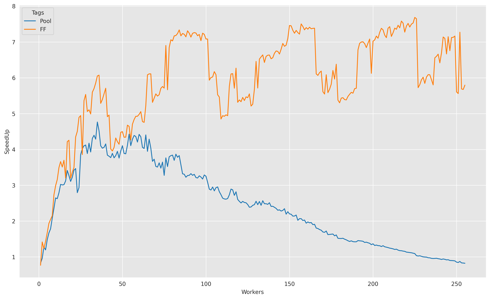
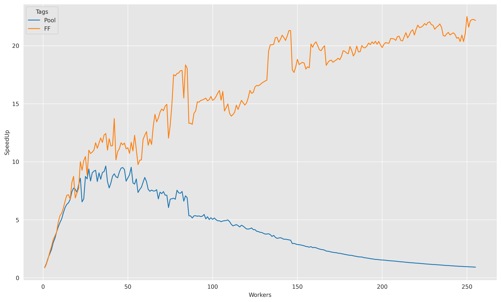

# Parallel Boruvka

A parallel implementation of the Boruvka algorithm (or Sollin's algorithm) for finding the Minimum Spanning Tree of a given graph


## Implementation

The parallel version of the Boruvka algorithm has been implemented with the following steps:

1. The set of edges of the graph is distributed among the available workers. Each one of them proceed by computing the array of shortest local edges given the available edges.
2. The indexes of the global shortest edge array are distributed among the workers again. Each one of them loop through the set of local edges computed in the previous phase and modify the global edge array in the according position
3. Components are fused together using the **Union-Find** data structure, merging the different trees. The workload is distributed among the workers again, allowing for concurrent accesses to the mentioned data structure thanks to the atomic implementation of it.
4. The set of edges is filtered in parallel by removing those edges that belong to the same component (same tree).
5. The set of nodes if filtered by leaving only the root nodes of the different trees in the data structure.


To speedup the process, the graph is loaded only at start, copy-constructing it at the end of the computation. 

Everything has been implemented in three different ways:
- Sequential version, for comparison.
- Thread parallel version, using a threadpool and async tasks.
- Fastflow version, using the algorithmic skeletons provided by [fastflow](https://github.com/fastflow/fastflow).


## Structure

```
📂Parallel Boruvka
├── 📂fastflow
│   ├── ....
├── 📂images
|   ├──📄15M_speedup.png
|   ├──📄30M_speedup.png
├── 📂lib
|   ├──📄dset.hpp # Implementation Union-Find data structure
|   ├──📄graph.hpp # Graph utilities and generator
|   ├──📄queue.hpp # General lock-wait queue implementation
|   ├──📄threadpool.hpp # Generic threadpool implementation 
|   ├──📄utils.hpp # Utils stuff
|   ├──📄utimer.hpp # Utimer class for microseconds precision
├── 📂papers 
|   ├──📄10.1.1.56.8354.pdf # Paper about Union-Find data structure
├── 📂py
|   ├──📄genplot.ipynb # Notebook for plots and measures
├── 📂report
|   ├──📄report.pdf # Project report
├── 📄Makefile 
├── 📄README.md
├── 📄boruvka_parallel_ff.cpp 
├── 📄boruvka_sequential.cpp 
├── 📄boruvka_thread.cpp                          
```

## Compiling and running

To compile the program, simply launch from the base directory

```bash
    make all
```

Three executable will be created in the build folder, respectively for the sequential, parallel thread and parallel fastflow version.

To run the experiments, launch from the base directory

```bash
    ./build/executable nw n_nodes n_edges filename iterations
``` 

where

- **nw**: stands for the maximum parallelism degree to be used. Do not specify this if you are running the sequential version.
- **n_nodes**: number of nodes of the graph to generate.
- **n_edges**: number of edges of the graph to generate.
- **filename**: add a filename if you want to load the graph from a given text file, specify an empty string ("") to generate the graph with the previous specified **n_nodes** and **n_edges**.
- **iters**: Number of iterations to perform for each **nw**, to measure the mean and std time of execution.


## Results

Below are some results of the speedup achieved on a XEON Phi machine, hosting 64 physical cores with 4-way hyperthreading. Hence the maximum **nw** was set to 256 threads.


